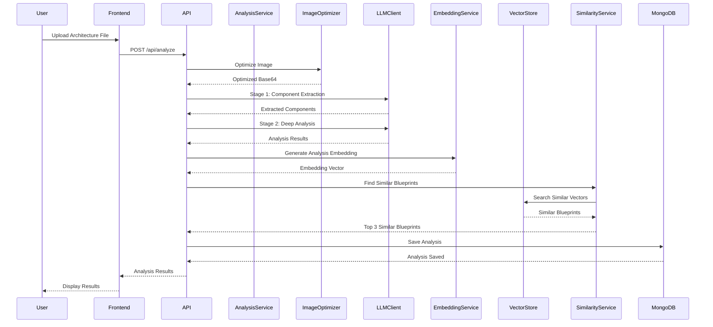
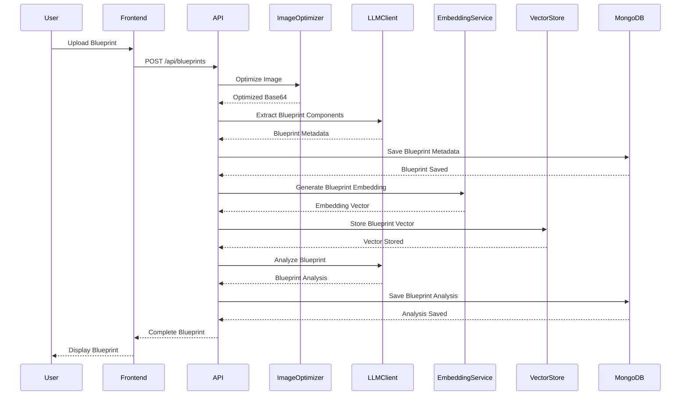
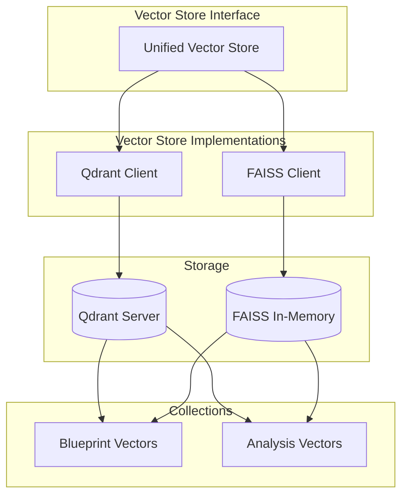
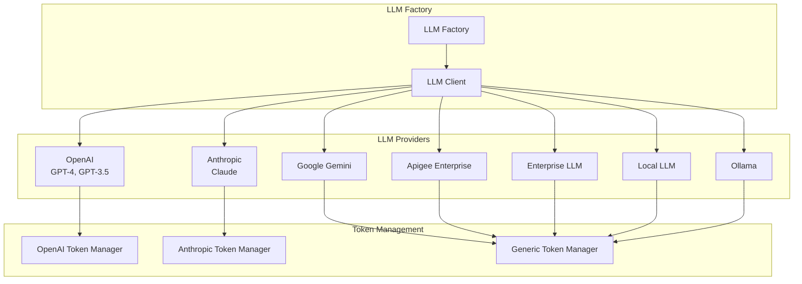
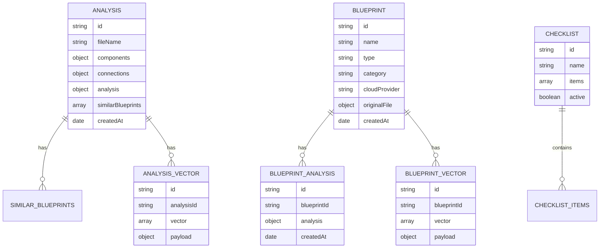
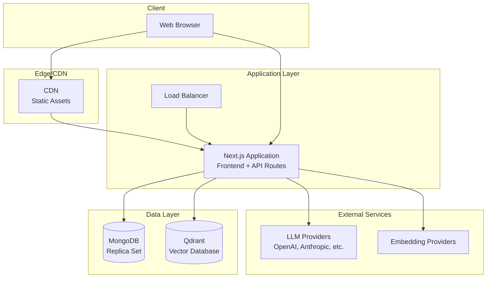

# ArchLens Application Architecture - Mermaid Diagram

## System Architecture Diagram

```mermaid
graph TB
    subgraph "Frontend Layer - Next.js 15"
        UI[React UI Components]
        Pages[Pages]
        Dashboard[Dashboard Page]
        Analyses[Analyses Page]
        Library[Library Page]
        Config[Configuration Page]
        
        UI --> Pages
        Pages --> Dashboard
        Pages --> Analyses
        Pages --> Library
        Pages --> Config
    end
    
    subgraph "API Layer - Next.js API Routes"
        AnalyzeAPI[/api/analyze]
        BlueprintAPI[/api/blueprints]
        AnalysisAPI[/api/analysis]
        ChecklistAPI[/api/checklist]
        DashboardAPI[/api/dashboard]
        ConfigAPI[/api/config]
        
        AnalyzeAPI --> AnalysisService
        BlueprintAPI --> BlueprintService
        AnalysisAPI --> AnalysisService
        ChecklistAPI --> ChecklistService
        DashboardAPI --> DashboardService
        ConfigAPI --> ConfigService
    end
    
    subgraph "Service Layer"
        AnalysisService[Analysis Service]
        BlueprintService[Blueprint Analysis Service]
        EmbeddingService[Embedding Service]
        SimilarityService[Similarity Service]
        ChecklistService[Checklist Service]
        ImageOptimizer[Image Optimizer]
        AnalysisCache[Analysis Cache]
        
        AnalysisService --> LLMClient
        AnalysisService --> EmbeddingService
        AnalysisService --> SimilarityService
        AnalysisService --> ImageOptimizer
        AnalysisService --> AnalysisCache
        
        BlueprintService --> LLMClient
        BlueprintService --> EmbeddingService
        BlueprintService --> SimilarityService
        
        SimilarityService --> EmbeddingService
        SimilarityService --> VectorStore
    end
    
    subgraph "Data Layer"
        MongoDB[(MongoDB)]
        VectorStore[Vector Store]
        Qdrant[(Qdrant)]
        FAISS[(FAISS In-Memory)]
        
        AnalysisService --> MongoDB
        BlueprintService --> MongoDB
        ChecklistService --> MongoDB
        
        VectorStore --> Qdrant
        VectorStore --> FAISS
        EmbeddingService --> VectorStore
    end
    
    subgraph "External Services"
        LLMClient[LLM Client Factory]
        EmbeddingClient[Embedding Client]
        
        LLMClient --> OpenAI[OpenAI]
        LLMClient --> Anthropic[Anthropic]
        LLMClient --> Gemini[Google Gemini]
        LLMClient --> Apigee[Apigee]
        LLMClient --> Enterprise[Enterprise LLM]
        LLMClient --> Local[Local LLM]
        LLMClient --> Ollama[Ollama]
        
        EmbeddingClient --> LocalEmbed[Local Embeddings]
        EmbeddingClient --> OpenAIEmbed[OpenAI Embeddings]
        EmbeddingClient --> CustomEmbed[Custom Provider]
    end
    
    subgraph "Models"
        AnalysisModel[Analysis Model]
        BlueprintModel[Blueprint Model]
        ChecklistModel[Checklist Model]
        BlueprintVectorModel[Blueprint Vector Model]
        
        AnalysisModel --> MongoDB
        BlueprintModel --> MongoDB
        ChecklistModel --> MongoDB
        BlueprintVectorModel --> VectorStore
    end
    
    UI --> AnalyzeAPI
    UI --> BlueprintAPI
    UI --> AnalysisAPI
    UI --> ChecklistAPI
    UI --> DashboardAPI
    UI --> ConfigAPI
    
    EmbeddingService --> EmbeddingClient
    
    style UI fill:#e1f5ff
    style Pages fill:#e1f5ff
    style AnalyzeAPI fill:#fff4e1
    style BlueprintAPI fill:#fff4e1
    style AnalysisService fill:#e8f5e9
    style BlueprintService fill:#e8f5e9
    style MongoDB fill:#f3e5f5
    style VectorStore fill:#f3e5f5
    style LLMClient fill:#ffe0e0
    style EmbeddingClient fill:#ffe0e0
```

## Data Flow Diagram



## Blueprint Upload Flow



## Component Architecture

```mermaid
graph LR
    subgraph "Frontend Components"
        Header[Header]
        FileUpload[FileUpload]
        AnalysisResults[AnalysisResults]
        BlueprintManager[BlueprintManager]
        BlueprintViewer[BlueprintViewer]
        DashboardStats[DashboardStats]
        ChecklistManager[ChecklistManager]
    end
    
    subgraph "API Endpoints"
        Analyze[/api/analyze]
        Blueprints[/api/blueprints]
        BlueprintID[/api/blueprints/[id]]
        AnalysisID[/api/analysis/[id]]
        Checklist[/api/checklist]
    end
    
    subgraph "Core Services"
        AnalysisSvc[Analysis Service]
        BlueprintSvc[Blueprint Service]
        EmbeddingSvc[Embedding Service]
        SimilaritySvc[Similarity Service]
        ChecklistSvc[Checklist Service]
    end
    
    subgraph "Libraries"
        LLMFactory[LLM Factory]
        VectorStoreLib[Vector Store]
        EmbeddingClientLib[Embedding Client]
        MongoDBLib[MongoDB Client]
    end
    
    FileUpload --> Analyze
    AnalysisResults --> AnalysisID
    BlueprintManager --> Blueprints
    BlueprintViewer --> BlueprintID
    ChecklistManager --> Checklist
    
    Analyze --> AnalysisSvc
    Blueprints --> BlueprintSvc
    AnalysisID --> AnalysisSvc
    Checklist --> ChecklistSvc
    
    AnalysisSvc --> LLMFactory
    AnalysisSvc --> EmbeddingSvc
    AnalysisSvc --> SimilaritySvc
    BlueprintSvc --> LLMFactory
    BlueprintSvc --> EmbeddingSvc
    
    EmbeddingSvc --> EmbeddingClientLib
    SimilaritySvc --> VectorStoreLib
    AnalysisSvc --> MongoDBLib
    BlueprintSvc --> MongoDBLib
```

## Vector Store Architecture



## LLM Provider Architecture



## Database Schema Relationships



## Deployment Architecture



