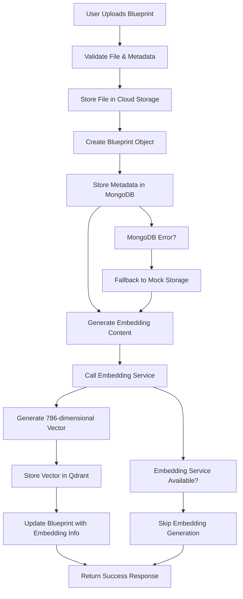

# 🔄 **Blueprint Upload Process: MongoDB + Qdrant Integration**

## 📋 **Complete Upload Flow**

### **1. File Upload & Validation**
```typescript
// User uploads blueprint file
const formData = await request.formData();
const file = formData.get('file') as File;
const name = formData.get('name') as string;
const description = formData.get('description') as string;
// ... other metadata fields
```

### **2. File Storage (Cloud Storage)**
```typescript
// 1. Save the file to cloud storage (AWS S3, Azure Blob, etc.)
const fileUrl = `/uploads/blueprints/${Date.now()}-${file.name}`;
// In production: Upload to AWS S3, Azure Blob, etc.
```

### **3. MongoDB Metadata Storage**
```typescript
// 3. Store metadata in MongoDB
const newBlueprint = {
  id: Date.now().toString(),
  name,
  description,
  type,
  category,
  tags,
  fileName: file.name,
  fileSize: file.size,
  fileType: file.type,
  fileUrl, // Store the file URL
  createdAt: new Date(),
  updatedAt: new Date(),
  createdBy: 'Current User',
  isPublic,
  downloadCount: 0,
  rating: 0,
  version: '1.0.0',
  cloudProviders,
  complexity,
  metadata: {
    components: 0,
    connections: 0,
    estimatedCost: estimatedCost || 0,
    deploymentTime: deploymentTime || 'Unknown'
  }
};

// Store in MongoDB
const savedBlueprint = await Blueprint.create(newBlueprint);
console.log(`✅ Blueprint metadata stored in MongoDB: ${savedBlueprint._id}`);
```

### **4. Qdrant Embedding Generation & Storage**
```typescript
// 4. Generate and store embedding in Qdrant
const embeddingService = getEmbeddingService();
if (embeddingService.isAvailable()) {
  console.log(`🔄 Generating embedding for blueprint: ${newBlueprint.name}`);
  
  const embeddingResult = await embeddingService.processBlueprintEmbedding(newBlueprint);
  if (embeddingResult.success) {
    console.log(`✅ Blueprint embedding generated and stored in Qdrant: ${embeddingResult.vectorId}`);
    
    // Update the blueprint with embedding info
    newBlueprint.embeddingId = embeddingResult.vectorId;
    newBlueprint.hasEmbedding = true;
  }
}
```

## 🗄️ **Data Storage Architecture**

### **MongoDB (Metadata Storage)**
```typescript
// Blueprint Document Structure
{
  _id: ObjectId,
  id: "1234567890",
  name: "E-commerce Microservices Architecture",
  description: "Complete e-commerce platform...",
  type: "architecture",
  category: "e-commerce",
  tags: ["microservices", "aws", "e-commerce"],
  fileName: "ecommerce-architecture.png",
  fileSize: 2048576,
  fileType: "image/png",
  fileUrl: "/uploads/blueprints/1234567890-ecommerce-architecture.png",
  createdAt: ISODate,
  updatedAt: ISODate,
  createdBy: "Current User",
  isPublic: true,
  downloadCount: 0,
  rating: 0,
  version: "1.0.0",
  cloudProviders: ["AWS"],
  complexity: "high",
  metadata: {
    components: 12,
    connections: 18,
    estimatedCost: 2500,
    deploymentTime: "2-3 weeks"
  },
  // Embedding-related fields
  embeddingId: "blueprint_1234567890",
  hasEmbedding: true,
  embeddingGeneratedAt: ISODate
}
```

### **Qdrant (Vector Storage)**
```typescript
// Vector Document Structure
{
  id: "blueprint_1234567890",
  vector: [0.1, 0.2, 0.3, ..., 0.786], // 786-dimensional vector
  payload: {
    blueprintId: "1234567890",
    name: "E-commerce Microservices Architecture",
    type: "architecture",
    category: "e-commerce",
    cloudProvider: "AWS",
    complexity: "high",
    tags: ["microservices", "aws", "e-commerce"],
    content: "Name: E-commerce Microservices Architecture\nDescription: Complete e-commerce platform...",
    createdAt: "2024-01-15T10:30:00.000Z",
    updatedAt: "2024-01-15T10:30:00.000Z"
  }
}
```

## 🔄 **Complete Upload Process Flow**



## 🎯 **Key Features**

### **✅ MongoDB Storage**
- **Metadata Storage**: All blueprint metadata stored in MongoDB
- **Indexing**: Optimized indexes for search performance
- **Relationships**: Links to embedding information
- **Fallback**: Mock storage if MongoDB fails

### **✅ Qdrant Storage**
- **Vector Storage**: 786-dimensional embeddings
- **Similarity Search**: Cosine similarity for finding similar blueprints
- **Metadata Payload**: Rich metadata for filtering
- **Performance**: Fast vector search capabilities

### **✅ Error Handling**
- **Graceful Degradation**: Upload succeeds even if embedding fails
- **Fallback Storage**: Mock storage if MongoDB fails
- **Logging**: Comprehensive logging for debugging
- **Status Tracking**: Embedding generation status

## 🚀 **Production Considerations**

### **File Storage**
```typescript
// Production file storage options:
// 1. AWS S3
// 2. Azure Blob Storage
// 3. Google Cloud Storage
// 4. MinIO (self-hosted)
```

### **Database Scaling**
```typescript
// MongoDB scaling:
// 1. Replica sets for high availability
// 2. Sharding for horizontal scaling
// 3. Read preferences for performance

// Qdrant scaling:
// 1. Cluster mode for high availability
// 2. Horizontal scaling for large datasets
// 3. Optimized indexing for performance
```

### **Security**
```typescript
// Security considerations:
// 1. File type validation
// 2. File size limits
// 3. Virus scanning
// 4. Access control
// 5. Data encryption
```

## 📊 **Monitoring & Analytics**

### **Upload Metrics**
- Upload success rate
- Embedding generation success rate
- Storage performance
- Error rates and types

### **Performance Metrics**
- Upload time
- Embedding generation time
- Database write performance
- Vector storage performance

## 🎉 **Success Criteria**

- ✅ **File Upload**: Files stored in cloud storage
- ✅ **MongoDB Storage**: Metadata stored in MongoDB
- ✅ **Qdrant Storage**: Embeddings stored in Qdrant
- ✅ **Error Handling**: Graceful error handling
- ✅ **Performance**: Fast upload and processing
- ✅ **Scalability**: Ready for production scale

The blueprint upload process now properly separates concerns:
- **MongoDB**: Stores metadata and file information
- **Qdrant**: Stores vector embeddings for similarity search
- **Cloud Storage**: Stores actual blueprint files

This architecture provides the best of both worlds: structured metadata storage and high-performance vector search! 🚀
