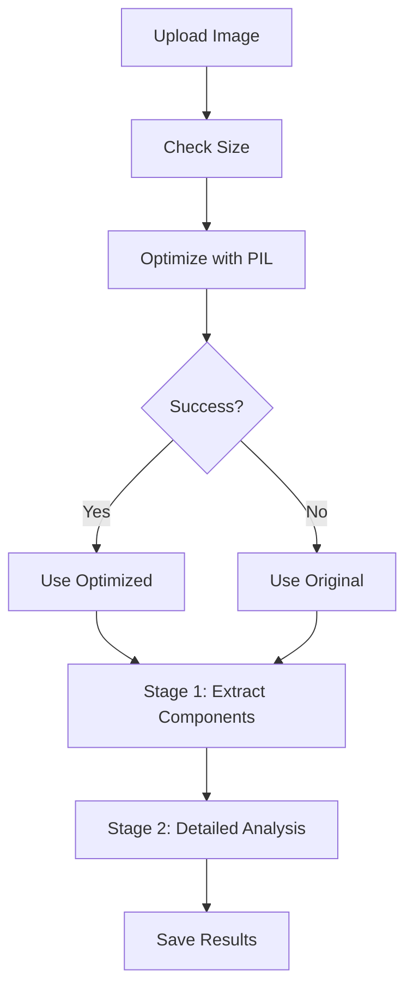

# 🚀 CloudArch Image Optimization Setup

## Prerequisites

### Node.js Installation
Ensure Node.js 18+ is installed on your system:

```bash
# Check Node.js version
node --version

# Install if needed (macOS with Homebrew)
brew install node

# Install if needed (Ubuntu/Debian)
sudo apt update && sudo apt install nodejs npm
```

## Quick Setup

### 1. Install JavaScript Dependencies
```bash
cd archlens-app
npm install
```

### 2. Start Development Server
```bash
npm run dev
```

## Features

### 🎯 Intelligent Compression (Sharp.js)
- **Automatic quality adjustment** based on image size
- **Dimension optimization** (max 512x512, maintains aspect ratio)
- **Format conversion** (PNG → JPEG for better compression)
- **Progressive JPEG** with mozjpeg encoder for maximum compression
- **Smart resizing** with Lanczos algorithm for optimal LLM processing

### 📊 Compression Results
Typical compression ratios:
- **Screenshots**: 60-80% reduction
- **Architecture diagrams**: 70-85% reduction  
- **High-resolution images**: 80-95% reduction

### ⚡ Performance Benefits
- **Faster LLM processing** (smaller payloads)
- **Reduced token usage** (cost savings)
- **Better accuracy** (optimized quality maintains readability)
- **No context limits** (compressed images fit within limits)

## Usage Examples

### Test Image Optimization
```bash
# Test with sample image (default quality 60)
node test-image-optimization.js architecture-diagram.png

# Custom quality settings
node test-image-optimization.js detailed-diagram.png --quality=80
node test-image-optimization.js large-diagram.png --quality=50
```

### API Integration (Automatic)
The optimization runs automatically when you upload images through the CloudArch interface.

### Programmatic Usage
```typescript
import { smartOptimizeImage } from './src/services/imageOptimizer';

const result = await smartOptimizeImage(base64Image, {
  quality: 60,
  maxWidth: 2048,
  maxHeight: 2048
});

if (result.success) {
  console.log(`Compressed by ${result.compression_ratio_percent}%`);
  // Use result.optimized_base64
}
```

## Troubleshooting

### Node.js Issues
```bash
# If Node.js version is too old
node --version  # Should be 18+

# Update Node.js (macOS)
brew upgrade node

# Update Node.js (Windows with Chocolatey)
choco upgrade nodejs

# Update Node.js (Ubuntu/Debian)
sudo apt update && sudo apt upgrade nodejs npm
```

### Sharp Installation Issues
```bash
# Reinstall Sharp if issues occur
npm uninstall sharp
npm install sharp

# For Apple Silicon Macs, you might need:
npm install sharp --platform=darwin --arch=arm64

# Clear npm cache if persistent issues
npm cache clean --force
npm install
```

### Memory Issues with Large Images
```bash
# Increase Node.js memory limit
export NODE_OPTIONS="--max-old-space-size=4096"
npm run dev
```

## Architecture Flow



## Optimization Settings

### Quality Guidelines
- **90-100**: Lossless/near-lossless (large files)
- **70-80**: High quality (recommended for detailed diagrams)
- **50-70**: Balanced (default for most cases)
- **30-50**: Aggressive (for very large files)
- **10-30**: Maximum compression (emergency only)

### Dimension Guidelines
- **4K+ images**: Resize to 2048x2048
- **2K images**: Keep original size
- **HD images**: Keep original size
- **Small images**: Keep original size

### File Type Handling
- **PNG → JPEG**: Better compression, removes transparency
- **GIF → JPEG**: Static conversion, better quality
- **TIFF → JPEG**: Dramatic size reduction
- **WebP → JPEG**: Universal compatibility

## Integration Points

### API Route Integration
The optimization is automatically used in `/api/analyze` when processing images:

```typescript
// Automatic Sharp-based optimization in analyze route
const optimizationResult = await smartOptimizeImage(originalBase64, {
  quality: originalSizeKB > 1000 ? 50 : 70, // Adaptive quality
  maxWidth: 512,
  maxHeight: 512
});

// Uses Sharp with mozjpeg encoder for maximum compression and LLM compatibility
```

### Database Storage
Optimization metadata is stored with analysis results:

```json
{
  "imageOptimization": {
    "original_size_kb": 2500,
    "optimized_size_kb": 650,
    "compression_ratio": 74.0,
    "dimensions": [1920, 1080]
  }
}
```

This setup ensures CloudArch can handle any size architecture diagram while maintaining optimal performance and accuracy! 🎯
